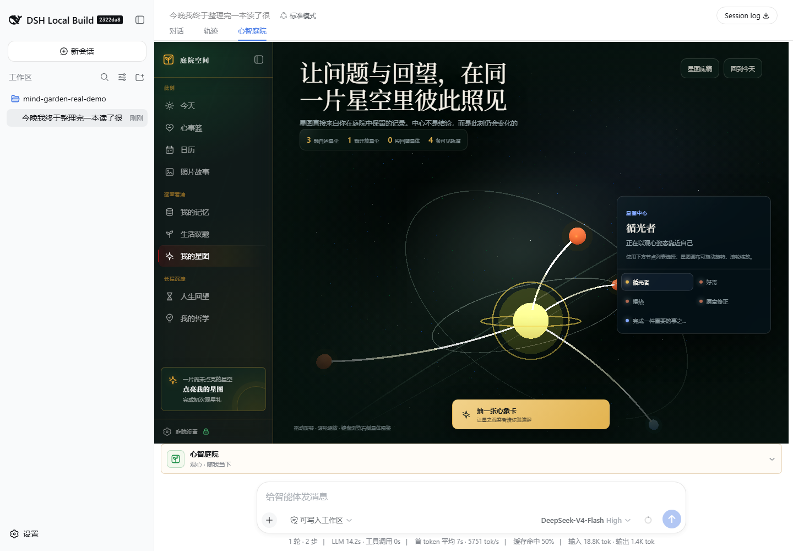
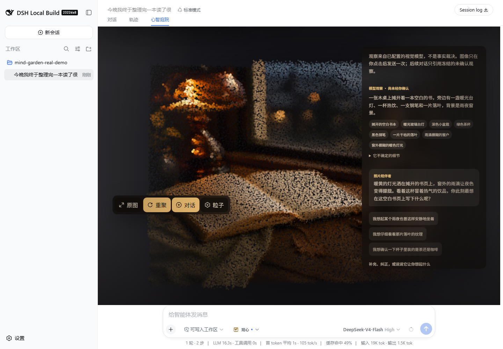
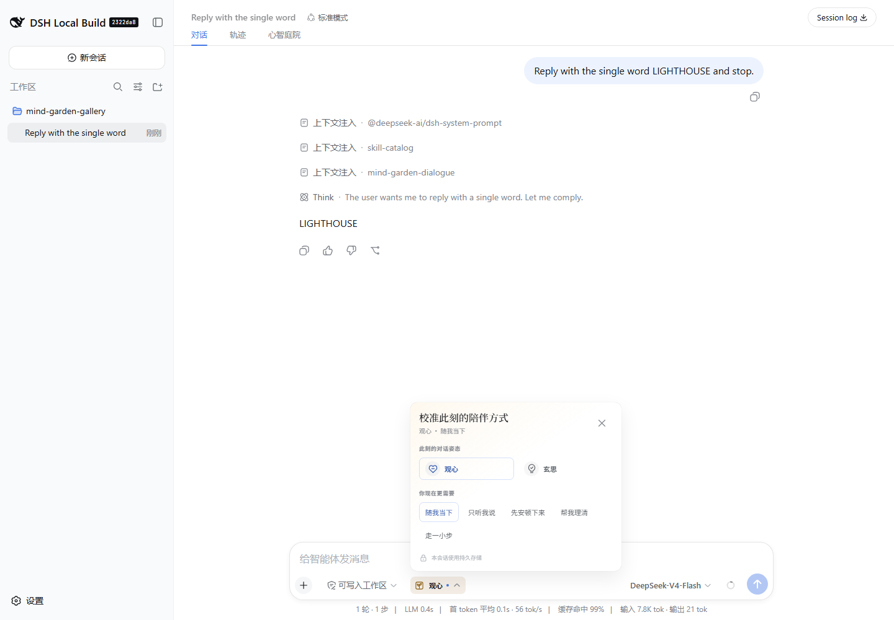
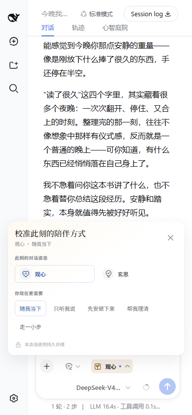
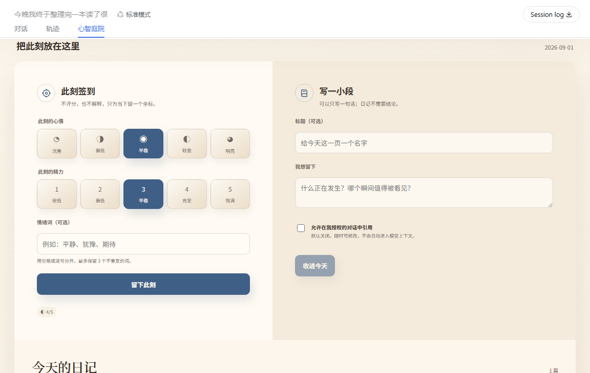
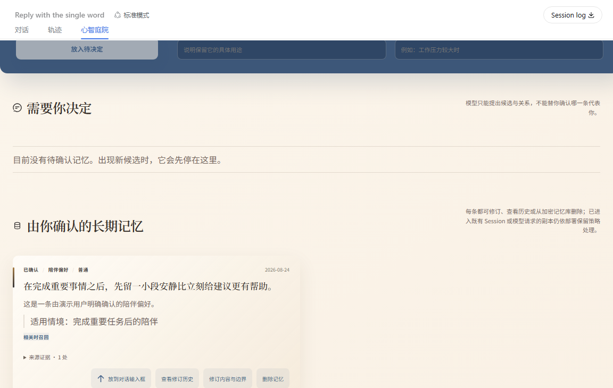
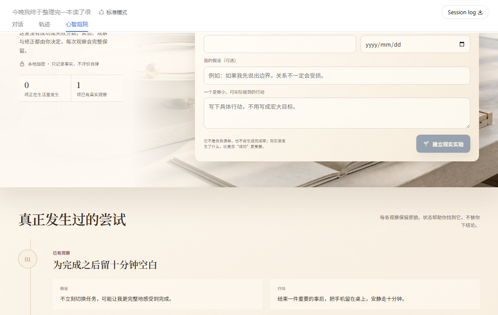
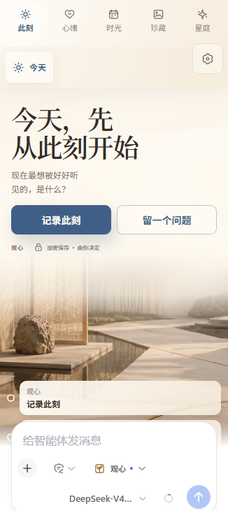
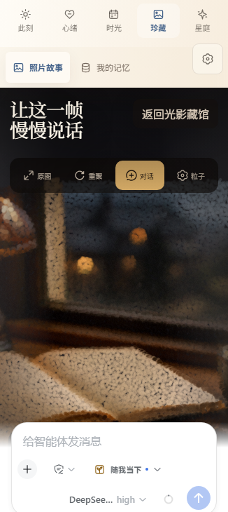
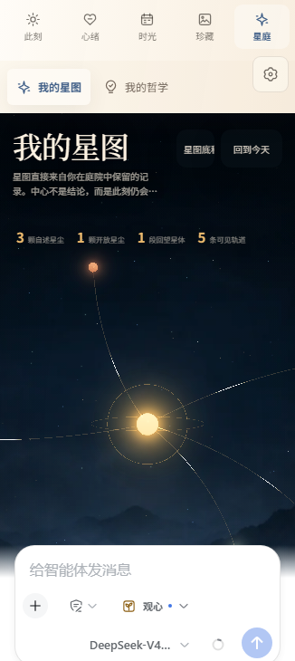

<p align="center">
  
</p>

<h1 align="center">Mind Garden</h1>

<p align="center">
  <strong>A warm, private place to reflect inside DeepSeek Harness.</strong><br>
  Real companion dialogue, user-governed memory, cinematic photo particles, and a living 3D constellation—without giving the model ownership of your story.
</p>

<p align="center">
  <a href="https://github.com/hyyhf/mindgarden/actions/workflows/verify.yml"></a>
  
  
  
  
</p>

<p align="center">English · <a href="README.zh.md">简体中文</a></p>

Mind Garden is an installable companion and private-reflection workspace for the DeepSeek Harness Web profile. Ordinary conversation remains a Harness Session while the garden adds encrypted personal records, governed memory, original Fun Garden migration, nine connected reflection spaces, and expressive 3D and photo-particle scenes.

It reuses Harness providers, credentials, storage, attachments, Remotes, and plugin lifecycle. It does not fork or copy the DeepSeek Harness application.

### Enter the garden in three commands

```sh
dsh plugin --profile web add git+https://github.com/hyyhf/mindgarden.git
dsh plugin --profile web why @deepseek-ai/dsh-mind-garden
dsh web
```

Requires DeepSeek Harness `0.1.1-rc.1` or newer, `pnpm` on `PATH`, and a configured model provider. Photo observation uses the official DeepSeek route and requires a Harness-managed `DEEPSEEK_API_KEY`. See [Install](#install) for profile requirements, updates, and local development.

## A real journey, not a mockup

The sequence below comes from one fresh Harness Web session. A user enters Mind Garden, sends a reflective message to `deepseek-v4-flash`, saves an open question, completes the constellation ritual, switches to the compact layout, admits a photograph, and asks `deepseek-v4-flash-vision-exp` to observe it. The tests assert the provider and model recorded in the durable events before saving these screenshots.

<table>
  <tr>
    <td width="50%"><br><strong>1 · A real companion turn</strong><br>The response passes through the shipped dialogue and safety plugins, then appears in the ordinary Harness conversation.</td>
    <td width="50%"><br><strong>2 · The result becomes useful</strong><br>The user saves a question through the UI and sees it become a truthful station in the morning courtyard.</td>
  </tr>
  <tr>
    <td width="50%"><br><strong>3 · A constellation with provenance</strong><br>Self-authored traits and the open question become distinguishable nodes around the current self.</td>
    <td width="50%"><br><strong>4 · A grounded photo observation</strong><br>The vision model describes visible details and returns an explicitly unconfirmed observation beside the live particle scene.</td>
  </tr>
</table>

<p align="center">
  <br>
  <sub>The same session in a 390 px viewport; the main actions and the Harness composer remain reachable.</sub>
</p>

## Conversation posture, at the point of use

At rest, Mind Garden adds only one compact control to the Harness composer toolbar: its icon and the current posture. Opening it reveals the two dialogue postures and five support intents in a focused, non-modal panel—without placing a full-width control strip above the conversation.

<table>
  <tr>
    <td width="68%"><br><strong>Precise when opened</strong><br>The panel stays anchored to the compact composer control and leaves the active conversation readable.</td>
    <td width="32%"><br><strong>Reachable at 390 px</strong><br>The same controls fit the viewport and preserve the send path.</td>
  </tr>
</table>

Posture and support intent apply only to the current Session. A successful change closes the panel; a failed change keeps it open with a localized status. Outside click and <kbd>Esc</kbd> dismiss it, keyboard focus returns to the trigger, and backup, restore, migration, and key rotation remain in Garden settings. Both frames above were captured from the installed plugin after a real Harness conversation turn.

## A garden that leaves conclusions with you

Mind Garden is for conversations that benefit from patience, continuity, and user authority rather than another task dashboard. Its design follows four rules:

- **Companion, not clinician** — the agent can listen, reflect, and ask one useful question, but does not diagnose or impersonate professional care.
- **The user owns every conclusion** — extracted memories, inferred traits, Star Observer cards, principle revisions, and relationship conflicts stay provisional until the user decides.
- **Private records stay structurally private** — memories, reflections, star data, and story metadata are authenticated ciphertext at rest; model calls receive only the bounded material authorized for that exact action.
- **A real Harness plugin** — the bundle is a manifest-declared Web-profile add-on. It reuses Harness agents, Sessions, providers, credentials, attachments, Remotes, loader rows, and the official client shell.

Compared with the original Fun Garden implementation, this edition adds evidence-bound memory governance, crash-recoverable key rotation, authenticated non-overwriting restore, deterministic safety gates, accessible WebGL fallbacks, and package-level extension boundaries. It keeps the expressive constellation and photo-particle identity while adopting the restrained spacing, icon language, and interaction grammar of DeepSeek Harness.

## Nine spaces, one garden

The persistent garden rail exposes nine spaces:

| Space | What it is for |
|---|---|
| **Today** | A quiet daily threshold, immutable mood and energy check-ins, encrypted journals, and an orbit of current reflections. |
| **Concerns** | A private concern basket with optional dates, completion, editing, and explicit conversion into a journal or conversation draft. |
| **Calendar** | A projection of verified check-ins, journals, concerns, principles, experiments, and open questions; it creates no hidden analysis. |
| **Photo Stories** | Verified image admission, encrypted story copy, configurable GPU particles, explicit visual observation, and story-owned follow-up dialogue. |
| **Memory** | Manual and model-assisted proposals, evidence review, sensitivity and recall controls, conflict resolution, revision history, and deletion. |
| **Growth** | Reality experiments and append-only observations without success scores or silent model judgment. |
| **My Constellation** | A resumable first-observation ritual, private profile, self-reported stars, evidence-scoped Star Observer cards, calibration, and a live 3D field. |
| **Life Review** | Week, month, and year material snapshots plus saved reviews whose original sources remain inspectable even after later changes. |
| **My Philosophy** | Contemplation notes, accepted notes, versioned principles, and open questions that can remain unresolved. |

## The complete live gallery

Every desktop image below comes from the real DeepSeek Harness Web composition. The deterministic gallery scenario writes fictional, repository-owned records through the installed Host services, admits the generated demo photograph through Harness attachments, opens the working Client space, and captures the rendered result. No personal material or static UI mockup is used.

### Entry and disclosure


The entry keeps model disclosure, profile storage, emergency limits, and the user's confirmation authority visible before either companion posture can activate.

### Today


Today combines the tactile orrery, current question, saved review, daily check-in, and journal path without turning the opening into a generic dashboard.



The second frame shows the result of opening the daily workbench: a complete check-in, journal editor, retrieval consent, and the records already created for the day.

### Concerns


Concerns keeps each item private and inert until the user edits it, completes it, converts it into a journal, or deliberately places it in the Harness composer.

### Calendar


Calendar projects the verified check-in, journal, concern, principle, experiment, and open question into one month and one selected-day ledger; visual density does not create synthetic activity.

### Photo Stories


The light archive preserves the verified original, title, story note, and collection state before the scene opens.


The fictional rain-night still life is a repository-owned ImageGen fixture with committed prompt provenance. Harness attachment admission, verified image reads, bounded WebGL particles, presets, re-composition, original-image viewing, story editing, and observation disclosure remain live product controls.

### Memory



The record shows its confirmed state, source count, scope, sensitivity, recall policy, history, edit path, composer handoff, and deletion control instead of presenting model familiarity as an irreversible profile.

### Growth



Growth records a hypothesis, one concrete action, and what happened. It preserves the observation without a score, streak, or model-assigned success verdict.

### My Constellation


The constellation is not a decorative personality score. Its center is the current self; self-reported traits, questions, and review material remain distinguishable. Star Observer calls are explicit and permission-bounded, while the adjacent node list preserves the same information without relying on canvas pixels.

### Life Review


Life Review places the verified period, source count, lifecycle state, and user-authored interpretation on one chronological plane. Later source changes cannot silently rewrite the preserved review.

### My Philosophy


Philosophy keeps confirmed contemplation, inert proposal, and adopted principle states structurally separate. Formation context, direct quote, counterexample, scope, status, and complete versions stay user-governed.

### Garden settings


Settings provide a second path to the same Session posture and support intent while keeping encrypted profile backup, authenticated restore, original Fun Garden migration, and crash-recoverable key rotation in one focused sheet. The everyday posture control remains in the composer toolbar; Harness still owns providers, models, Sessions, and attachments.

### Mobile composition

<p align="center">
  
  
  
</p>

The same plugin participates in the compact Harness shell. Navigation collapses, dense controls simplify, canvas work is bounded, and the fixed Harness composer remains available. The posture panel measures the viewport and flips above or below its trigger instead of creating a wide mobile bar. Reduced-motion and non-WebGL paths keep records usable without the visual scene. The integration gallery also captures compact entry, check-in, concerns, calendar, memory, growth, review, philosophy, and settings states under `assets/mind-garden-demo-mobile-*.png`.

## Install

Prerequisites:

- DeepSeek Harness `0.1.1-rc.1` or newer with a working `web` profile;
- `pnpm` on `PATH` for profile-forwarded plugin commands;
- at least one configured Harness model provider;
- a DeepSeek credential available to Harness as `DEEPSEEK_API_KEY` for Photo Story observation, which is pinned to `deepseek-official` / `deepseek-v4-flash-vision-exp`;
- a durable credentials and storage composition, which the standard Web profile already supplies.

Install the bundle directly from GitHub, confirm that the profile resolved the package, then start Web:

```sh
dsh plugin --profile web add git+https://github.com/hyyhf/mindgarden.git
dsh plugin --profile web why @deepseek-ai/dsh-mind-garden
dsh web
```

The repository includes the compiled Host modules and browser bundle, so installation does not build or copy the DeepSeek Harness source tree. To update to the latest commit later:

```sh
dsh plugin --profile web update @deepseek-ai/dsh-mind-garden
```

For local development, clone this repository and install the checkout from its root. DeepSeek Harness anchors `add .` to the invoking directory:

```sh
git clone https://github.com/hyyhf/mindgarden.git
cd mindgarden
npm test
dsh plugin --profile web add .
```

The bundle's [`cordis.patch.yml`](cordis.patch.yml) inserts every Host and Web row through the normal profile layer mechanism.

## First session

1. Configure the desired provider and model for ordinary companion dialogue in Harness Models. Provider credentials remain owned by Harness; Mind Garden has no API-key field. Explicit Photo Story observation uses the bundle's `deepseek-official` / `deepseek-v4-flash-vision-exp` route.
2. Create a blank Session and select the shipped **Mind Garden** preset when it is available from the active roster.
3. Choose **Enter Mind Garden** before the first message.
4. Read the storage, provider, and confirmation boundaries, then select **Serenity** for gentle presence or **Clarity** for more structured reflection.
5. After entry, use the compact posture control in the composer toolbar whenever the current Session needs a different posture or support intent.
6. Use the conversation normally. The **Mind Garden** tab opens the nine-space workspace, and garden settings holds backup, restore, and key rotation.

The bundle can be activated with another preset, but that preset's persona and tools still participate. Only the Mind Garden preset supplies the intended tool-free companion persona. External preset discovery is a Harness roster boundary; a separately installed npm bundle does not mutate another installation's roster.

## Architecture

One installable package composes eleven independently testable plugins:

| Loader row | Package | Responsibility |
|---|---|---|
| `mind-garden-vault` | [`mind-garden-vault`](packages/mind-garden/mind-garden-vault) | AES-256-GCM private-record storage and journaled key rotation. |
| `mind-garden-core` | [`mind-garden-core`](packages/mind-garden/mind-garden-core) | Event-sourced activation, dialogue posture, support intent, and disclosure acceptance. |
| `mind-garden-skills` | [`mind-garden-skills`](packages/mind-garden/mind-garden-skills) | Fifteen Harness-native companion, continuity, memory-governance, practice, philosophy, and Observer skills with explicit invocation and disclosure. |
| `mind-garden-memory` | [`mind-garden-memory`](packages/mind-garden/mind-garden-memory) | Governed long-term memory lifecycle, extraction, bounded recall, and encrypted audit. |
| `mind-garden-media` | [`mind-garden-media`](packages/mind-garden/mind-garden-media) | Verified photo stories, particle configuration, explicit visual observation, and story dialogue. |
| `mind-garden-reflection` | [`mind-garden-reflection`](packages/mind-garden/mind-garden-reflection) | Check-ins, journals, concerns, experiments, principles, questions, reviews, and projections. |
| `mind-garden-star-map` | [`mind-garden-star-map`](packages/mind-garden/mind-garden-star-map) | Ritual, private profile, traits, evidence-bound Observer cards, and calibration. |
| `mind-garden-dialogue` | [`mind-garden-dialogue`](packages/mind-garden/mind-garden-dialogue) | Stable model-visible companion policy and authorized context injection. |
| `mind-garden-safety` | [`mind-garden-safety`](packages/mind-garden/mind-garden-safety) | Deterministic input triage, local support responses, output buffering, and publication checks. |
| `mind-garden-portability` | [`mind-garden-portability`](packages/mind-garden/mind-garden-portability) | Encrypted backup, restore, original-profile migration, and user-confirmed key rotation. |
| `ui-mind-garden` | [`ui-mind-garden`](packages/client/ui-mind-garden) | Entry disclosure, composer-toolbar posture control, settings, nine spaces, 3D, particles, and responsive UI. |

Host packages own authorization and durable state. The Web client uses generated Typert Remotes and cannot bypass version checks, confirmation gates, attachment admission, or vault policy. Ordinary dialogue remains an ordinary Harness Session, so session history, provider selection, trajectory, and infrastructure are not reimplemented inside the plugin.

## Privacy and data ownership

The private vault has four fixed encrypted collections: `memories`, `reflections`, `media`, and `stars`. Each record uses a fresh nonce and AES-256-GCM authenticated encryption. Storage can observe collection names, opaque ids, counts, envelope timestamps, algorithm metadata, and a non-secret key fingerprint, but not authenticated JSON values. User text must never appear in record ids.

Important boundaries:

- The vault creates no credential merely because the plugin loaded. Its first initialization or private write asks the configured Harness credential provider for a data key.
- The key is re-resolved for every operation. Missing, malformed, or mismatched credentials fail closed instead of silently replacing a key over existing ciphertext.
- Backups use a user-held passphrase, scrypt, gzip, and AES-256-GCM. They omit the live vault credential so the destination keeps its own encryption authority.
- Restore authenticates and strictly decodes the complete archive before showing an add/keep preview. It adds missing ids only and never decrypts, compares, or overwrites an existing same-id record.
- Photo bytes use the configured Harness attachment provider. Encrypted metadata disappears on story deletion, while physical byte reclamation follows that provider's retention policy.
- Durable Sessions remain ordinary Harness history. This bundle does not advertise no-trace mode because it does not mount in-memory Session and attachment providers.

Losing the vault credential or an archive passphrase is unrecoverable. Mind Garden does not escrow either secret.

## Migrating the original Fun Garden

Garden settings accepts the original binary `MGPKG1` archive as well as the current `.mgarden` format. Inspection authenticates the PBKDF2/AES-GCM envelope, opens the embedded SQLite snapshot through a bounded read-only connection, validates its integrity, authenticates encrypted fields with the archived data key, and runs every converted row through the current strict decoder before presenting a preview.

| Original domain | Current result |
|---|---|
| Check-ins, journals, concerns and reminders | Converted to encrypted reflection records with deterministic ids. |
| Contemplation and accepted notes | Converted to current contemplation records; accepted notes preserve confirmation. |
| Principles and complete version history | Converted with source-note links when those links can be reconstructed. |
| Reality experiments and observations | Converted without inventing scores or conclusions. |
| Open questions and period reviews | Converted; review sources become frozen `legacy-original` manifests. |
| Evidence-backed long-term memories | Converted with `legacy-import` proposal provenance and current governance. |
| Star profile and self-reported traits | Converted; all cross-domain permissions reset to off. |
| Philosophy Markdown projections | Parsed as an additional compatible reflection source. |
| Photo Stories and particle settings | Converted with verified image objects and the complete bounded presentation configuration. |
| Conversation logs | Left in the source archive; current conversation history belongs to Harness Sessions. |
| Legacy Observer cards/runs and short-term derived analysis | Omitted because current evidence authority cannot be reconstructed safely. |
| Credentials, provider preferences and model settings | Never imported; these remain Harness-owned configuration. |

The original archive is read-only throughout inspection and restore. Keep it until the add/keep receipt and the visible garden records have been checked.

## Visual performance and accessibility

- The constellation and photo scenes use bounded WebGL work, device-memory-aware density, suspended rendering outside active views, and explicit resource disposal.
- Pointer physics, bloom, exposure, depth, paper motion, tint, and vignette stay within Host-validated configuration limits.
- Reduced-motion preferences disable nonessential movement. A constellation list and verified-image presentation remain available when WebGL or particle rendering is unavailable.
- Semantic headings, buttons, labels, focus states, readable contrast, and keyboard-accessible controls remain the source of truth; canvas pixels never become the only record interface.
- The client reuses Harness icons and shell spacing, while the garden owns its dark astronomical visual layer. Compact layouts collapse navigation and simplify density instead of shrinking desktop controls blindly.

## Verification

The repository-level checks confirm that all eleven runtime packages, compiled entrypoints, and Loader rows are present and that no install manifest retains a Harness workspace-only dependency:

```sh
npm test
npm run check
```

Release validation also installs the Git repository into a clean `web` profile, checks the resolved dependency with `dsh plugin --profile web why`, dumps the composed Loader configuration, starts the real Web server, and requests its browser entrypoint. The screenshots in this README additionally come from deterministic gallery coverage and real-provider runs against `deepseek-v4-flash` and `deepseek-v4-flash-vision-exp` in the full Harness Web composition.

## Provider and safety behavior

Mind Garden does not make a model request for every UI action.

| Action | Provider effect |
|---|---|
| Ordinary companion message | One normal Harness dialogue turn with stable Mind Garden policy, bounded authorized recall, and pre-publication safety review. |
| Elevated local-safety input | No provider call; a deterministic local response is published and audited. |
| Check-in, journal, concern, calendar, experiment, principle, question, review storage | No provider call. |
| Manual or authorized automatic memory review | One bounded auxiliary call; every proposal still requires user review. |
| Star Observer draw or card follow-up | One bounded auxiliary call scoped to the card and explicitly authorized evidence. |
| Photo observation or photo-owned follow-up | One bounded auxiliary call through `deepseek-official` / `deepseek-v4-flash-vision-exp`, scoped to the verified story; it is not appended to ordinary Session history. |
| Backup, restore, migration or key rotation | No provider call. |

Activated Mind Garden dialogue caps model output at 4,096 tokens unless the caller already requested less. This keeps the complete answer inside the deterministic publication buffer even when a provider adapter has a much larger deployment default. Other Harness agents and Mind Garden auxiliary calls retain their own limits.

Safety resources currently target mainland China and use a versioned local registry for `12356`, `110`, and `120`. The plugin does not claim verified emergency coverage for other regions and does not present itself as professional care.

## Remove

Create an encrypted archive first if a retained copy is required, then remove the Loader rows:

```sh
dsh plugin --profile web remove @deepseek-ai/dsh-mind-garden
```

Uninstalling a plugin is not data erasure. Existing Session history remains under its Session provider, encrypted private records remain in the configured storage backend, and unreferenced attachment bytes follow the attachment provider's retention policy.

## Model Experience

Indirectly, through the mounted dialogue, memory, safety, Star Observer, photo-observation, and agent-preset packages; ordinary companion turns use the selected Harness provider, while local reflection storage and portability do not.

#### KV Cache effect

Ordinary dialogue keeps a stable appended policy while authorized recall varies with the current query and confirmed state. Memory review, Star Observer, and Photo Story calls use stable task policies with variable bounded evidence or recent-turn JSON, so their suffixes usually change. Local storage, migration, backup, restore, and elevated local-safety steps create no provider KV Cache state.

## Known Limitations and Deferred Work

The current plugin covers the original nine destinations, companion entry modes, daily records, concerns, calendar projection, governed memories, reality experiments, philosophy notes and principles, life reviews, Star Map, Photo Stories, backup/restore, and authenticated private-profile migration. It exceeds the original in encrypted provenance, confirmation gates, conflict handling, evidence-scoped Observer work, key rotation, failure-closed decoding, responsive fallbacks, and Harness-native distribution.

The remaining differences are deliberate and visible:

- original conversation logs are not synthesized into profile records; Harness Session import/export should own conversation history;
- legacy life-topic background analysis is not imported because its derivation and evidence authority cannot be reconstructed;
- global daily reminders and quiet hours are not scheduled yet, although individual concerns retain reminder dates;
- profile-wide `full`, `distilled`, and `temporary` retention modes and a single destructive whole-garden erase ceremony are not yet exposed;
- the durable bundle cannot promise no-trace behavior until a composition supplies in-memory Session and attachment providers;
- separately installed bundles cannot automatically register an agent preset outside configured Harness roster roots;
- safety resource registries outside mainland China still require verified regional packages.

These are compatibility and composition boundaries, not hidden placeholders. The package directories in this repository contain the owning Host and Web implementations.
