<div align="center">
  <h1>🌌 心智庭院</h1>
  <p>为 DeepSeek Harness 打造的私密、由用户掌控的反思庭院。</p>
  <p>
    <a href="https://github.com/hyyhf/mindgarden/actions/workflows/verify.yml"></a>
    <a href="LICENSE"></a>
    
    
    
  </p>
  <p><a href="README.md">English</a> · 中文</p>
</div>

心智庭院是面向 DeepSeek Harness Web 的可安装陪伴对话与私密反思工作区。它把克制、可被模型看见的陪伴姿态，与九个由用户掌控的庭院空间、认证加密、受治理记忆、原版 Fun Garden 迁移、高质感 3D 与粒子场组合在一起，同时不替代 Harness 已有的 Session、模型提供方、凭据、附件或插件生命周期。

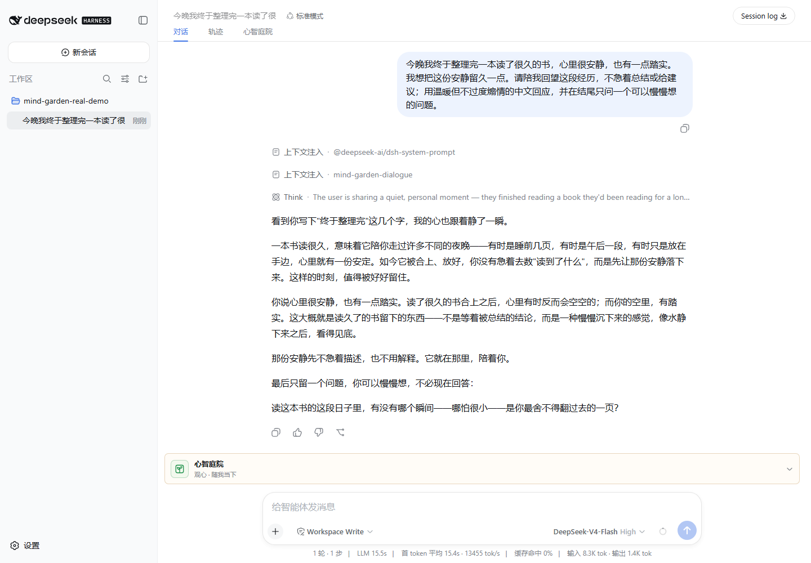

上图来自仓库内可选择开启的真实提供方端到端测试。回复由 `deepseek-v4-flash` 经内置 DeepSeek 适配器生成，再通过心智庭院安全边界，最终由真实 Web 装配渲染；不是 mock，也不是静态拼图。

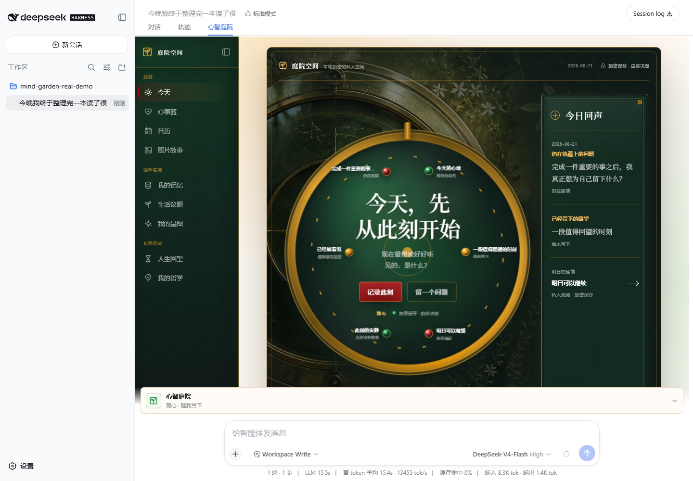

同一轮真实运行随后进入心智庭院，通过已安装的 Host 服务保存开放问题，并在实际 Harness 外壳中渲染“今天”罗盘。六条记录围绕清晰中心形成隐式轨道：稀疏校准标记保留纵深，但不会让坐标轴或连接曲线穿过反思提示。

## 为什么是心智庭院

心智庭院服务于那些需要耐心、连续性和用户决定权，而不是另一个任务面板的对话。它遵循四条原则：

- **陪伴，不冒充治疗**：Agent 可以倾听、映照并留下一个值得慢慢想的问题，但不会诊断，也不会冒充专业照护。
- **每个结论都由用户作主**：提取出的记忆、推测特质、Star Observer 星卡、原则修订和关系冲突，在用户决定前都只是候选。
- **私密记录具有结构性隐私**：记忆、反思、星图和故事元数据以认证密文持久化；模型只会收到当前动作明确授权的有界材料。
- **它是真正的 Harness 插件**：组合包通过 manifest 声明挂载到 Web profile，复用 Harness 的 Agent、Session、提供方、凭据、附件、Remote、Loader 配置行和官方客户端壳层。

相较原版 Fun Garden，这一版增加了证据绑定的记忆治理、崩溃可恢复换钥、认证且不覆盖的恢复、确定性安全门、可访问的 WebGL 降级路径和清晰的包级扩展边界；同时保留原版极具辨识度的星图与照片粒子气质，并采用 DeepSeek Harness 的克制间距、图标语言和交互语法。

## 九个庭院空间

常驻庭院导航包含九个空间：

| 空间 | 用途 |
|---|---|
| **今天** | 安静的每日入口、不可变心情与能量签到、加密日记，以及围绕当下记录形成的反思轨道。 |
| **心事篮** | 私密关切记录，可安排日期、完成、修改，并显式转成日记或带回对话的草稿。 |
| **日历** | 只投影已验证的签到、日记、心事、原则、实验与开放问题，不生成隐藏分析。 |
| **照片故事** | 验证图片准入、加密故事文字、可配置 GPU 粒子、显式视觉观察和故事自有追问。 |
| **我的记忆** | 手写与模型辅助候选、证据审阅、敏感度与召回控制、冲突处理、修订史和删除。 |
| **生活议题** | 现实实验与只追加观察，不设置成功分数，也不让模型暗中裁决。 |
| **我的星图** | 可恢复的首次观星礼、私密底稿、自述星尘、证据限定的 Star Observer 星卡、校准和实时 3D 星场。 |
| **人生回望** | 周、月、年材料快照及保存的回望；即使来源后来变化，也能检查当时所见。 |
| **我的哲学** | 沉思笔记、已采纳笔记、带完整修订史的原则，以及允许长期悬而未决的开放问题。 |

### 完整运行图册

下方所有桌面图都来自真实的 DeepSeek Harness Web 装配。确定性的图册场景通过已安装的 Host 服务写入仓库自有的虚构记录，让生成的演示照片经过 Harness 附件准入，打开可操作的 Client 空间，再捕获最终渲染结果；其中没有个人材料或静态 UI 拼图。

#### 进入与边界说明

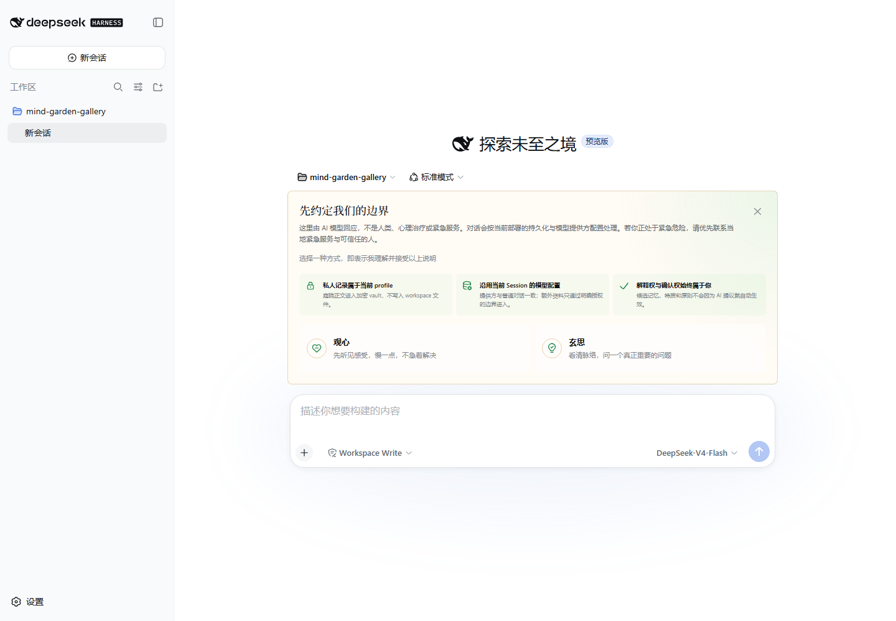

进入页会在任一陪伴姿态生效前明确模型说明、profile 存储、紧急情况限制和始终属于用户的确认权。

#### 今天

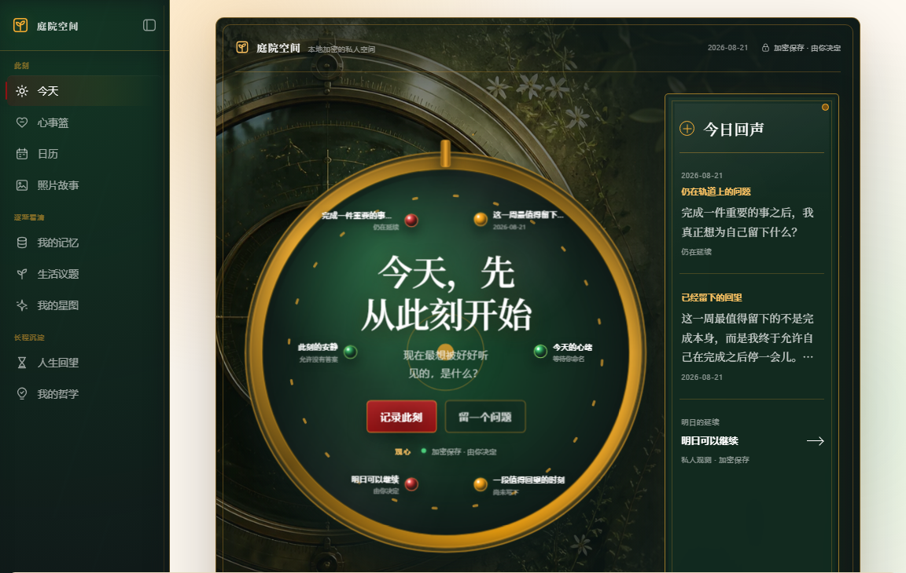

今天空间把具有材质感的星仪、当前问题、已保存回望、每日签到和日记入口组合在一起，同时避免变成通用仪表盘。

#### 心事篮


每条心事在用户修改、完成、转为日记或主动放入 Harness 输入框之前，都会保持私密且不会自动进入对话。

#### 日历

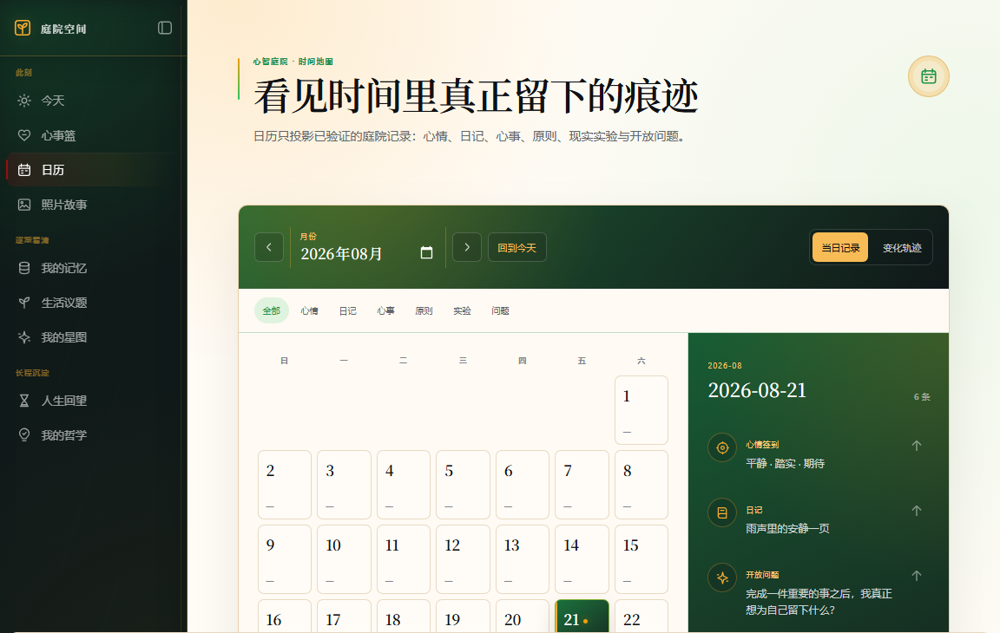

日历把已验证的签到、日记、心事、原则、实验和开放问题投影到同一个月视图与选中日期清单中，不会为了画面密度制造活动。

#### 照片故事


图中的雨夜静物是带已提交提示词来源记录的仓库自有 ImageGen fixture（测试前置数据）。Harness 附件准入、已验证原图读取、有界 WebGL 粒子、预设、重新聚成、查看原图、故事编辑和观察说明都是真实可操作的产品控件。

#### 我的记忆

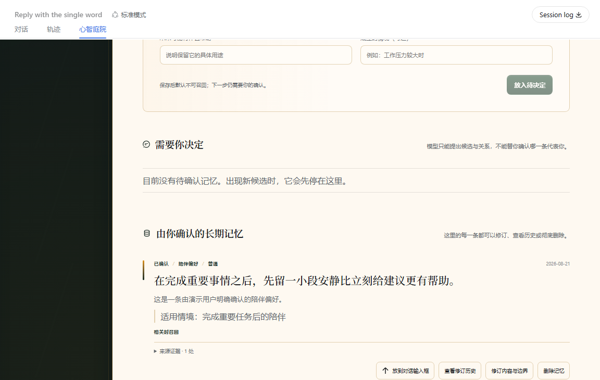

记录会展示确认状态、来源数量、适用范围、敏感度、召回策略、历史、编辑、输入框交接与删除控件，而不会把模型对用户的了解包装成不可更改的档案。

#### 生活议题

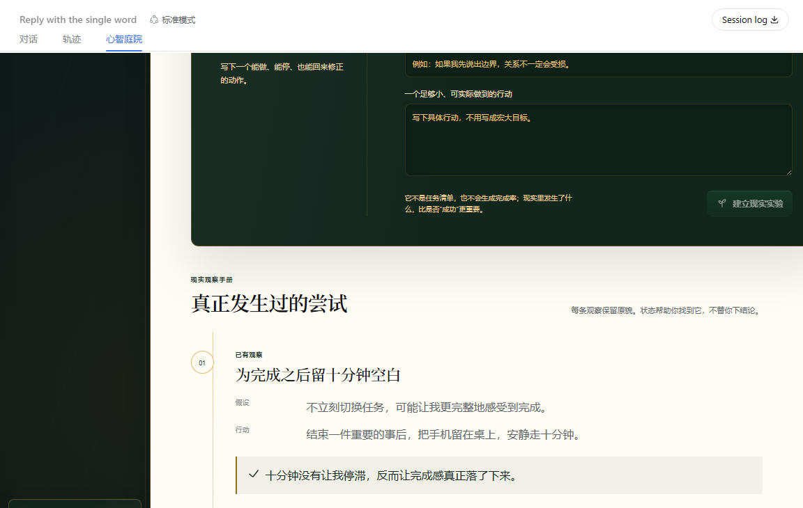

生活议题记录假设、一个具体行动和实际发生的事，并完整保留观察，不设置分数、连续天数或模型裁定的成功结论。

#### 我的星图

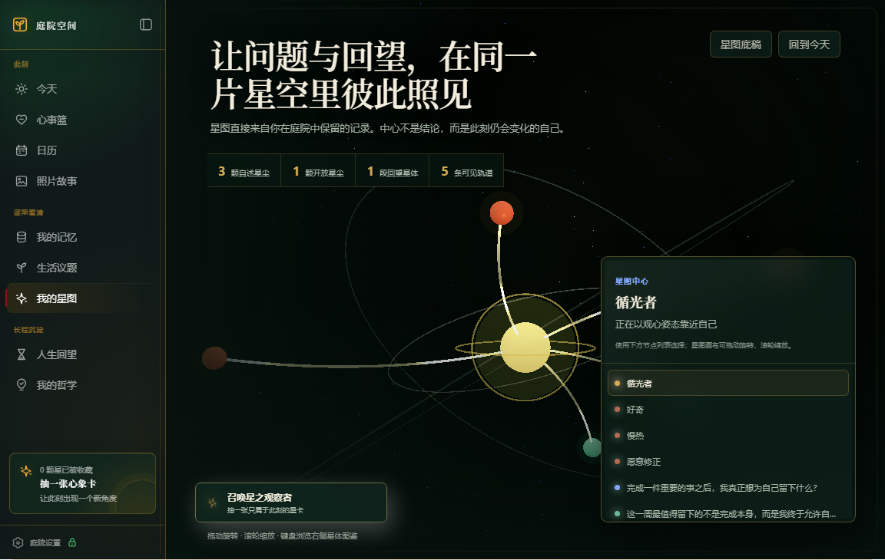

星图不是装饰性的性格评分。中心始终是当下自我；自述特质、问题和回望材料保持可区分。Star Observer 调用必须由用户显式发起并受权限约束，旁边的节点列表也会提供同样的信息，不依赖 Canvas 像素。

#### 人生回望

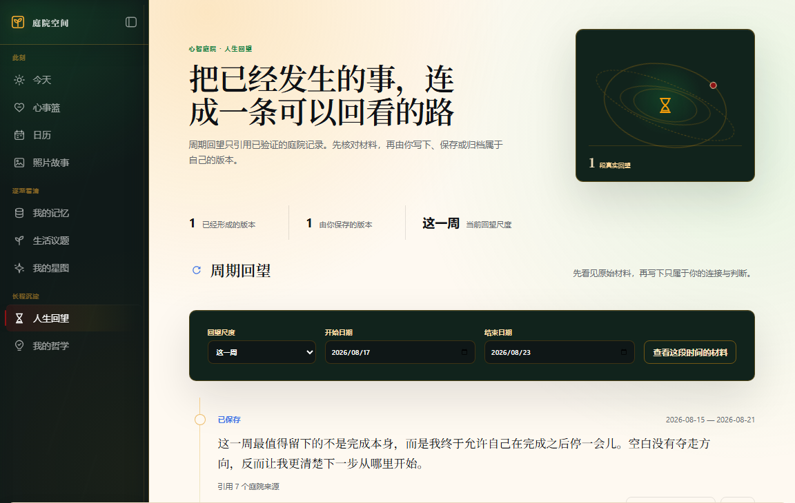

人生回望会在同一条时间平面上展示已验证周期、来源数量、生命周期状态和用户写下的理解；来源后来变化也不会暗中改写已经保存的回望。

#### 我的哲学

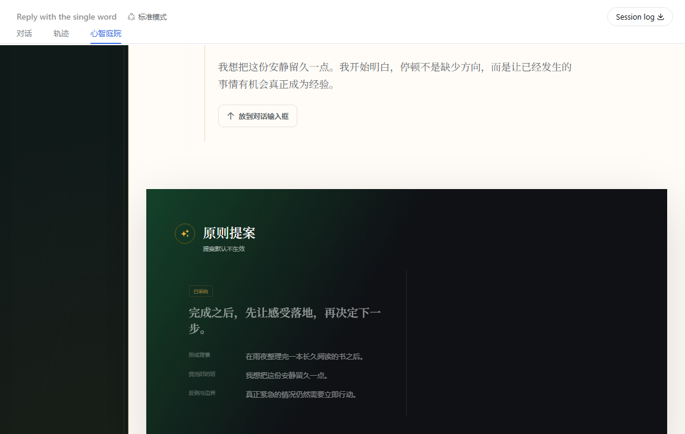

哲学空间会从结构上分开已确认沉思、未生效提案和已采纳原则。形成背景、原话、反例、适用范围、状态和完整版本始终由用户治理。

#### 庭院设置

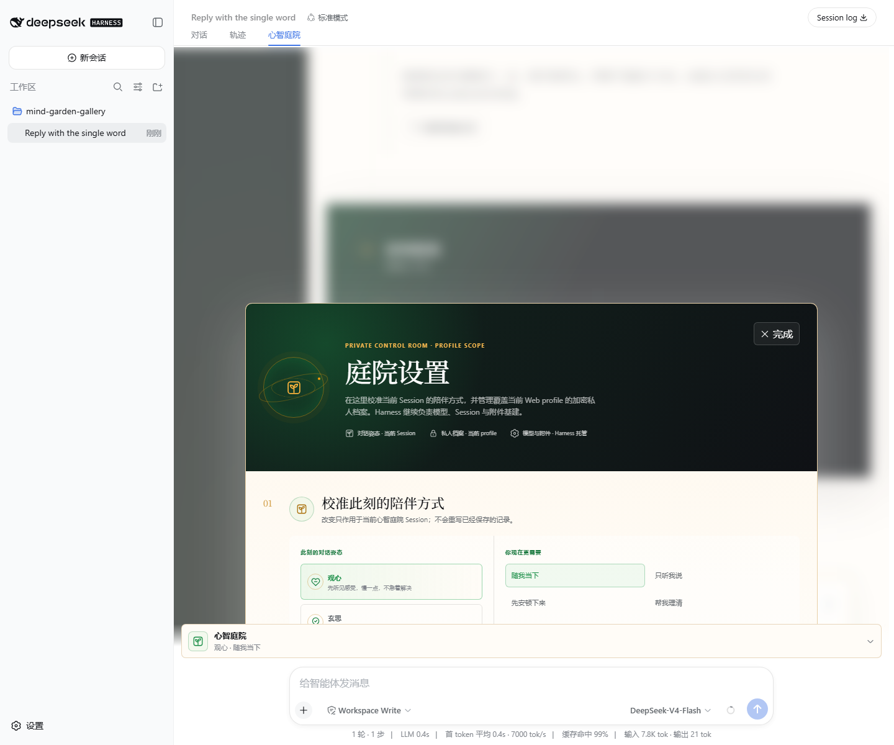

设置面板负责校准当前 Session 的对话姿态和支持意图，并在同一聚焦面板中提供加密 profile 备份、认证恢复、原版 Fun Garden 迁移与崩溃可恢复换钥；提供方、模型、Session 和附件仍由 Harness 管理。

#### 移动端装配

<p align="center">
  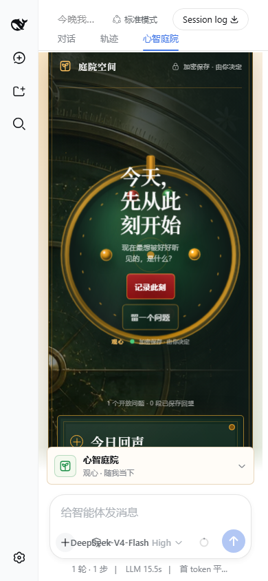
</p>

同一个插件会进入 Harness 紧凑壳层：导航收起、密集控制简化、Canvas 工作量受限，同时保留 Harness 固定输入区。开启减少动态效果或缺少 WebGL 时，记录仍可通过列表与静态图片使用。

## 安装

前提：

- DeepSeek Harness `0.1.1-rc.1` 或更高版本，且已能运行 `web` profile；
- `pnpm` 位于 `PATH`，用于 profile 转发的插件命令；
- 至少配置了一个 Harness 模型提供方；
- 使用持久凭据与存储装配，标准 Web profile 已提供这些依赖。

直接从 GitHub 安装组合包，确认 profile 已解析到该包，然后启动 Web：

```sh
dsh plugin --profile web add git+https://github.com/hyyhf/mindgarden.git
dsh plugin --profile web why @deepseek-ai/dsh-mind-garden
dsh web
```

仓库已经提交编译后的 Host 模块与浏览器 bundle，安装过程不会构建或复制 DeepSeek Harness 源码树。后续升级到最新提交：

```sh
dsh plugin --profile web update @deepseek-ai/dsh-mind-garden
```

本地开发时可克隆仓库，并从仓库根目录安装 checkout。DeepSeek Harness 会把 `add .` 锚定到命令调用目录：

```sh
git clone https://github.com/hyyhf/mindgarden.git
cd mindgarden
npm test
dsh plugin --profile web add .
```

组合包的 [`cordis.patch.yml`](cordis.patch.yml) 会通过标准 profile 层机制插入全部 Host 与 Web 配置行。

## 第一次使用

1. 在 Harness 普通的模型设置中配置提供方和模型。提供方凭据继续由 Harness 管理，心智庭院没有 API Key 输入框。
2. 新建空白 Session；如果当前 roster 已提供内置**心智庭院**预设，请选择它。
3. 在发送第一条消息前选择**进入心智庭院**。
4. 阅读存储、提供方与确认权边界，再选择偏温柔陪伴的**观心**或偏结构化反思的**玄思**。
5. 像普通 Harness 对话一样使用。**心智庭院**标签页会打开九空间工作区；备份、恢复与换钥位于庭院设置。

也可以在其他预设下启用组合包，但该预设的 persona 和工具仍会参与。只有心智庭院预设提供预期的无工具陪伴 persona。外部预设发现属于 Harness roster 边界；单独安装的 npm 包不会修改另一份安装的 roster。

## 架构

一个可安装组合包装配十个可独立测试的插件：

| Loader 配置行 | 包 | 职责 |
|---|---|---|
| `mind-garden-vault` | [`mind-garden-vault`](packages/mind-garden/mind-garden-vault) | AES-256-GCM 私密记录存储与 journal 化换钥。 |
| `mind-garden-core` | [`mind-garden-core`](packages/mind-garden/mind-garden-core) | 事件溯源的启用状态、对话姿态、支持意图和披露确认。 |
| `mind-garden-memory` | [`mind-garden-memory`](packages/mind-garden/mind-garden-memory) | 长期记忆治理、提取、有界召回和加密审计。 |
| `mind-garden-media` | [`mind-garden-media`](packages/mind-garden/mind-garden-media) | 已验证照片故事、粒子参数、显式视觉观察和故事对话。 |
| `mind-garden-reflection` | [`mind-garden-reflection`](packages/mind-garden/mind-garden-reflection) | 签到、日记、关切、实验、原则、问题、回望和投影。 |
| `mind-garden-star-map` | [`mind-garden-star-map`](packages/mind-garden/mind-garden-star-map) | 观星礼、私密资料、特质、证据绑定 Observer 星卡和校准。 |
| `mind-garden-dialogue` | [`mind-garden-dialogue`](packages/mind-garden/mind-garden-dialogue) | 稳定且模型可见的陪伴策略与已授权上下文注入。 |
| `mind-garden-safety` | [`mind-garden-safety`](packages/mind-garden/mind-garden-safety) | 确定性输入分流、本地支持回复、输出缓冲和发布检查。 |
| `mind-garden-portability` | [`mind-garden-portability`](packages/mind-garden/mind-garden-portability) | 加密备份、恢复、原版迁移和用户确认换钥。 |
| `ui-mind-garden` | [`ui-mind-garden`](packages/client/ui-mind-garden) | 进入披露、对话贡献、设置、九空间、3D、粒子与响应式 UI。 |

Host 包负责权限和持久状态。Web 客户端通过生成的 Typert Remote 工作，不能绕过版本检查、确认门、附件准入或 vault 策略。普通陪伴仍是普通 Harness Session，因此历史、提供方选择、轨迹和基础设施不会在插件里重复实现。

## 隐私与数据所有权

私密 vault 有四个固定加密集合：`memories`、`reflections`、`media` 和 `stars`。每条记录都使用新的 nonce 与 AES-256-GCM 认证加密。存储后端可以观察集合名、不透明 id、数量、信封时间、算法元数据和非秘密密钥指纹，但看不到经过认证的 JSON 值。用户文本不得出现在记录 id 中。

重要边界：

- 插件加载本身不会创建凭据。首次初始化或写入私密数据时，vault 才会请求已配置的 Harness 凭据提供方保存数据密钥。
- 每次操作都会重新解析密钥。缺失、格式错误或不匹配会失败关闭，不会在现有密文上静默生成替代密钥。
- 备份使用用户持有口令、scrypt、gzip 与 AES-256-GCM，并刻意省略实时 vault 凭据，让目标端保留自己的加密权限。
- 恢复会先认证并严格解码完整档案，再展示“新增／保留”预览；它只补入缺失 id，绝不会解密、比较或覆盖当前同 id 记录。
- 照片字节由已配置的 Harness 附件提供方保存。删除故事会移除加密元数据，而物理字节回收遵守附件提供方的保留策略。
- 持久 Session 仍是普通 Harness 历史。本组合包没有挂载内存 Session 与附件提供方，因此不会宣传无痕模式。

遗失 vault 凭据或档案口令都无法恢复；心智庭院不会托管这两类秘密。

## 从原版 Fun Garden 迁移

庭院设置同时接受当前 `.mgarden` 和原版二进制 `MGPKG1` 档案。检查过程会认证 PBKDF2/AES-GCM 信封，通过受限只读连接打开内嵌 SQLite 快照并校验完整性，用档案数据密钥认证加密字段，再让每一条转换记录通过当前严格解码器，最后才展示预览。

| 原版领域 | 当前处理 |
|---|---|
| 签到、日记、心事及提醒 | 使用确定性 id 转为加密反思记录。 |
| 沉思笔记与已采纳笔记 | 转为当前沉思记录；已采纳状态保留为确认来源。 |
| 原则与完整版本史 | 转换完整修订历史；能重建时保留来源笔记关联。 |
| 现实实验与观察 | 转换，但不虚构评分或结论。 |
| 开放问题与周期回望 | 转换；回望来源成为冻结的 `legacy-original` manifest。 |
| 带证据的长期记忆 | 使用 `legacy-import` 提案来源进入当前治理流程。 |
| 星图资料与自述特质 | 转换；所有跨领域权限重置为关闭。 |
| 哲思 Markdown 投影 | 作为另一种兼容反思来源解析。 |
| 照片故事与粒子设置 | 转换已验证图片对象和完整的有界展示参数。 |
| 对话日志 | 留在源档案；当前对话历史由 Harness Session 负责。 |
| 原版 Observer 星卡／运行与短期派生分析 | 不迁入，因为当前证据权限无法安全重建。 |
| 凭据、提供方偏好与模型设置 | 永不导入，继续由 Harness 配置负责。 |

检查与恢复期间，原档案始终只读。在核对“新增／保留”回执与庭院可见记录前，请保留原文件。

## 视觉性能与可访问性

- 星图与照片场景使用有界 WebGL 工作量、基于设备内存的密度、非活动视图暂停渲染和显式资源释放。
- 指针物理、辉光、曝光、景深、纸页运动、统一色与暗角都受 Host 校验的参数范围约束。
- 减少动态效果偏好会关闭非必要运动；WebGL 或粒子不可用时，仍提供星图列表和已验证原图。
- 语义标题、按钮、标签、焦点状态、可读对比度和键盘操作是信息源；Canvas 像素从不成为唯一记录入口。
- 客户端复用 Harness 图标与壳层间距，庭院只拥有自身的深色天文表现层。紧凑布局会折叠导航并简化密度，而不是盲目缩小桌面控件。

## 验证

仓库级检查会确认十个运行时包、编译入口和 Loader 配置行完整存在，并确保安装清单不再含 Harness 工作区专用依赖：

```sh
npm test
npm run check
```

发布验证还会把 Git 仓库安装进一个干净的 `web` profile，通过 `dsh plugin --profile web why` 检查解析结果，导出组合后的 Loader 配置，启动真实 Web 服务器并请求浏览器入口。本 README 的截图还经过完整 Harness Web 装配下的确定性图册覆盖与可选择开启的真实提供方运行验证。

## 提供方与安全行为

心智庭院不会为每个 UI 操作调用模型。

| 动作 | 提供方影响 |
|---|---|
| 普通陪伴消息 | 一轮标准 Harness 对话，带稳定心智庭院策略、有界授权召回和发布前安全检查。 |
| 升高的本地安全输入 | 不调用提供方；发布并审计确定性本地回复。 |
| 签到、日记、心事、日历、实验、原则、问题与回望存储 | 不调用提供方。 |
| 手动或已授权自动记忆整理 | 一次有界辅助调用；每条候选仍需用户审阅。 |
| Star Observer 抽卡或星卡追问 | 一次辅助调用，只包含星卡与显式授权证据。 |
| 照片观察或照片自有追问 | 一次辅助调用，只属于已验证故事，不写入普通 Session 历史。 |
| 备份、恢复、迁移或换钥 | 不调用提供方。 |

已启用的心智庭院普通对话会把模型输出限制为 4096 tokens，除非调用方已经设置了更小值。这样即使适配器具有非常大的部署默认值，完整答案也能留在确定性发布缓冲内。其他 Harness Agent 与心智庭院辅助调用保留各自的上限。

当前安全资源面向中国大陆，使用版本化本地 `12356`、`110`、`120` 注册表。插件不会声称覆盖未经核验的其他地区，也不会把自己描述成专业照护。

## 移除

如需保留副本，请先创建加密档案，再移除 Loader 配置行：

```sh
dsh plugin --profile web remove @deepseek-ai/dsh-mind-garden
```

卸载插件不等于删除数据。已有 Session 历史仍由 Session 提供方管理，加密私密记录仍在已配置存储后端中，失去引用的附件字节遵守附件提供方的保留策略。

## 模型体验

通过挂载的对话、记忆、安全、Star Observer、照片观察与 agent 预设包间接影响模型；普通陪伴轮次使用所选 Harness 提供方，本地反思存储与可迁移操作则不会调用模型。

#### KV Cache 影响

普通对话保留稳定的追加策略，已授权召回会随当前查询与确认状态变化。记忆整理、Star Observer 和照片故事调用使用稳定任务策略，以及变化的有界证据或最新轮次 JSON，因此后缀通常会变化。本地存储、迁移、备份、恢复和升高的本地安全步骤不会创建提供方 KV Cache 状态。

## 已知限制与暂缓事项

当前插件已覆盖原版九个导航空间、陪伴入口模式、每日记录、心事、日历投影、受治理记忆、现实实验、哲思笔记与原则、人生回望、星图、照片故事、备份恢复和认证私人 profile 迁移。它在加密来源、确认门、冲突处理、证据限定 Observer、换钥、失败关闭解码、响应式降级与 Harness 原生分发方面已经超过原版。

仍然存在且不会被隐藏的差异：

- 原版对话日志不会被合成为 profile 记录；对话历史应由 Harness Session 导入导出负责；
- 原版生活议题后台分析不会迁入，因为其推导过程与证据权限无法安全重建；
- 全局每日提醒与安静时段尚未接入调度器，但单条心事的提醒日期会保留；
- profile 级 `full`、`distilled`、`temporary` 保留模式和一次性破坏性“删除整个庭院”仪式尚未提供；
- 在装配提供内存 Session 与附件提供方前，持久组合包不能承诺无痕；
- 独立安装的组合包无法越过 Harness roster root 自动注册 agent 预设；
- 中国大陆以外的安全资源仍需要经过核验的区域包。

这些是兼容与装配边界，不是隐藏占位。本仓库中的各包目录包含对应 Host 与 Web 实现。
